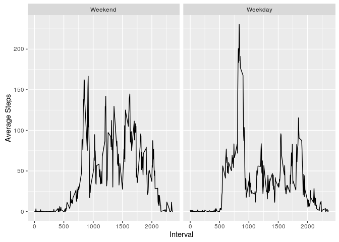

# Reproducible Research: Peer Assessment 1


## Loading and preprocessing the data

```r
unzip("activity.zip")
data <- read.csv("activity.csv")
```

## What is mean total number of steps taken per day?

```r
dailySteps <- tapply(data$steps, data$date, sum, na.rm=TRUE)
hist(dailySteps, xlab="Total Daily Steps", main="Histogram of Total Daily Steps")
```

<!-- -->

### Mean:

```r
mean(dailySteps)
```

```
## [1] 9354.23
```

### Median:

```r
median(dailySteps)
```

```
## [1] 10395
```

## What is the average daily activity pattern?


```r
intervalSteps <- with(data, tapply(steps, interval, mean, na.rm=TRUE))
plot(unique(data$interval), intervalSteps, type="l", xlab="Time Interval", 
     ylab="Average Steps", main="Average Daily Activity Pattern")
```

<!-- -->

### Interval with max average steps:

```r
names(which(intervalSteps==max(intervalSteps)))
```

```
## [1] "835"
```

## Imputing missing values

### How many missing values are there?

```r
missing <- which(is.na(data$steps))
sum(missing)
```

```
## [1] 21483648
```

### Replace NAs with mean for the interval

```r
filledData <- data
filledData$steps[missing] <- intervalSteps[as.factor(data$interval[missing])]
```

### Compare to original data set

```r
dailyStepsFilled <- tapply(filledData$steps, filledData$date, sum, na.rm=TRUE)
hist(dailyStepsFilled, xlab="Total Daily Steps", main="Histogram of Daily Steps (NAs imputed)")
```

<!-- -->

Mean:

```r
mean(dailyStepsFilled)
```

```
## [1] 10766.19
```

Median:

```r
median(dailyStepsFilled)
```

```
## [1] 10766.19
```

One can see that the median and mean have increased from their original values, with
a larger increase in the mean than median.

## Are there differences in activity patterns between weekdays and weekends?

Let's use the dplyr package to make manipulating the data set somewhat easier:

```r
library(dplyr)
```

```
## 
## Attaching package: 'dplyr'
```

```
## The following objects are masked from 'package:stats':
## 
##     filter, lag
```

```
## The following objects are masked from 'package:base':
## 
##     intersect, setdiff, setequal, union
```

```r
tbldata <- tbl_df(filledData)
tbldata <- mutate(tbldata, date=as.POSIXct(date))
tbldata <- mutate(tbldata, daytype = weekdays(date) %in% c("Saturday","Sunday"))
tbldata <- mutate(tbldata, daytype=factor(tbldata$daytype, levels=c(TRUE,FALSE),
                                          labels=c("Weekend","Weekday")))
intervals <- group_by(tbldata, daytype, interval)
means <- summarize(intervals, avg=mean(steps))
```

Viewing the differences graphically:

```r
library(ggplot2)
qplot(interval, avg, data=means, facets=.~daytype, geom="line", 
      xlab="Interval", ylab="Average Steps")
```

<!-- -->

We see a slight spike in morning weekday activity, but otherwise the trends are not substantially different.
